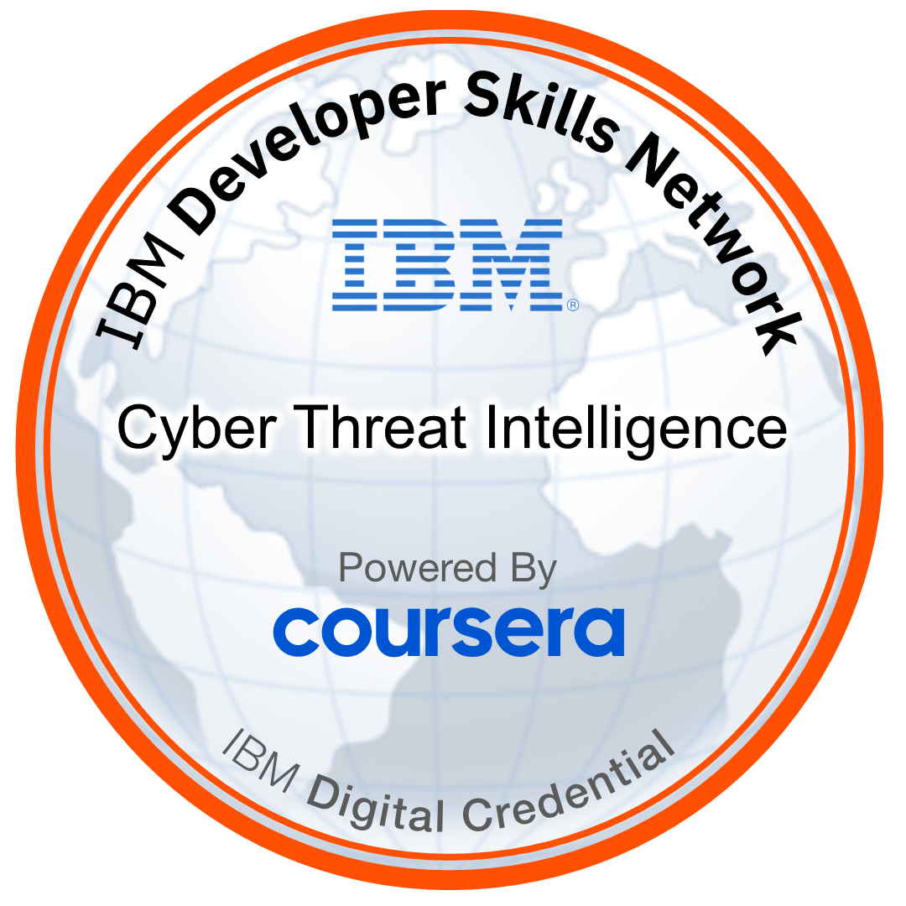
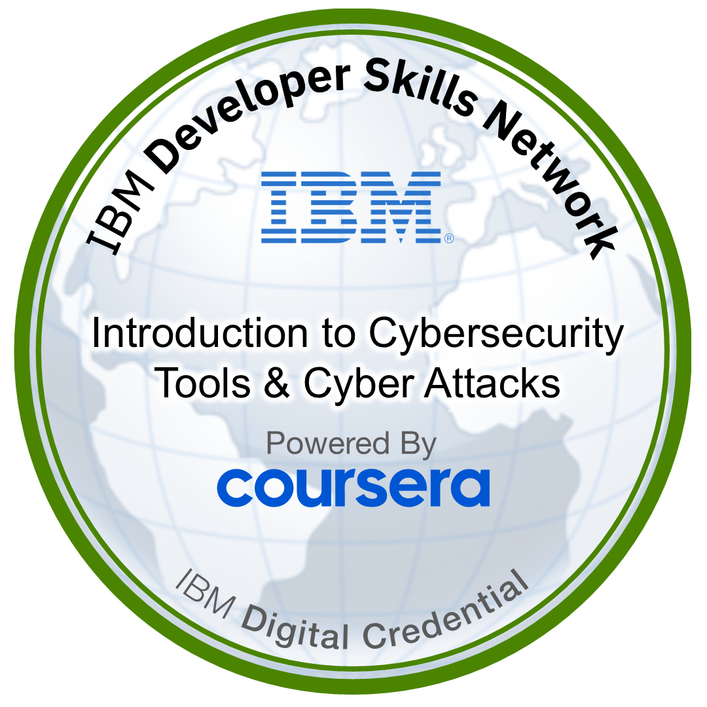
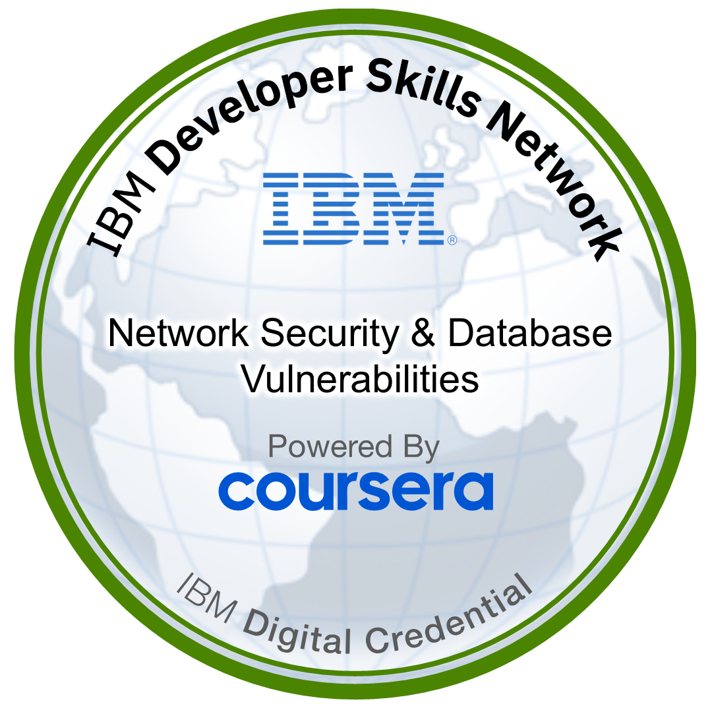
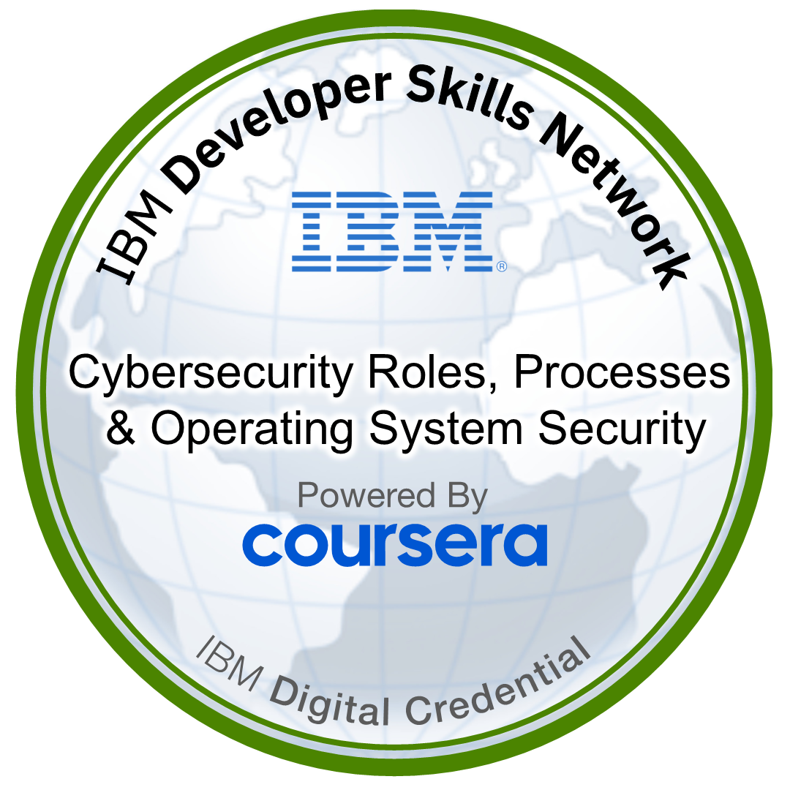
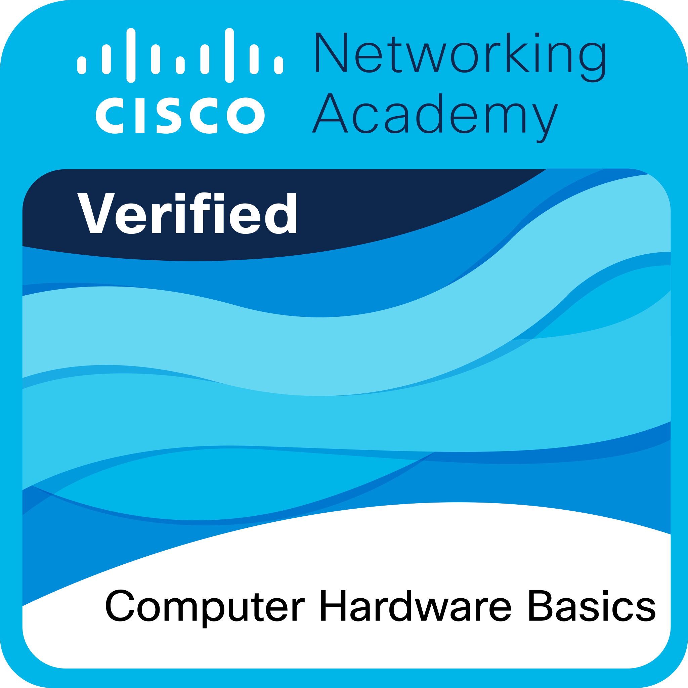
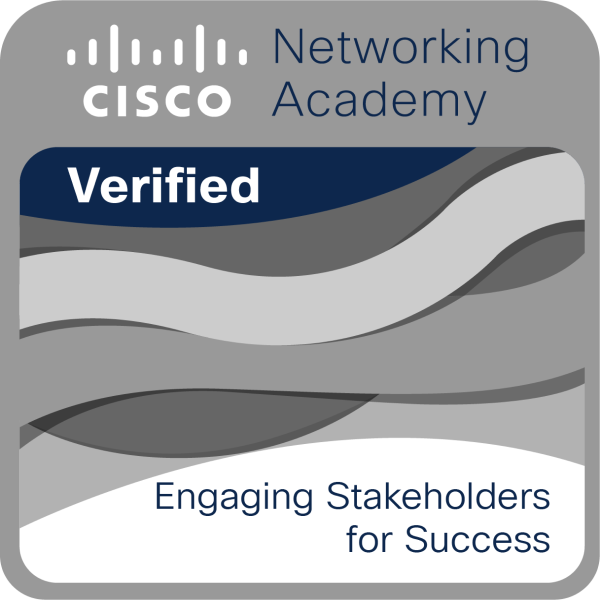
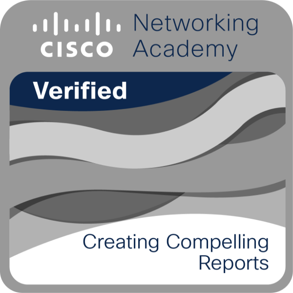

# Stellar Ticket // Sovereign IT Architecture

Stellar Ticket is a full-stack, multi-tenant IT Support and Cybersecurity ticketing platform built as a comprehensive Capstone Project. It demonstrates advanced systems engineering, role-based access control (RBAC), and persistent data management wrapped in a highly immersive, cinematic interface.

## Capstone Objectives & Technical Achievements
- **Multi-Tenant Architecture**: Engineered a dynamic Node.js backend that securely isolates client data based on corporate `Team ID` assignments.
- **SLA Engine & Breach Monitoring**: Built a custom time-tracking engine that monitors ticket lifecycles against strict Priority matrices (1H Emergency, 24H Normal) and triggers UI alarms upon breach.
- **Role-Based Access Control**: Implemented strict routing and UI rendering logic. Clients experience a streamlined portal, IT Support orchestrates complex workflows, and Cybersecurity accesses deep system metadata via the "Shadow Vector" terminal.
- **Content Management System (CMS)**: Integrated a live Knowledge Base authoring suite allowing technicians to write, categorize, and deploy system protocols directly to the user dashboard.
- **Persistent State Management**: Linked the React `TicketContext` to browser local storage, ensuring that active sessions, layout preferences, and UI states survive navigation and refresh cycles.

---

## Certifications & Documentation

As part of my professional development and readiness for enterprise IT operations, I have completed the following certifications and documented my technical workflows.

### 📄 Documentation
- [**Understanding Ticketing Systems (Portfolio)**](./public/assets/dossier/PORTFOLIO-Understanding-Ticketing-Systems.pdf)
- [**Certification Breakdown PDF**](./public/assets/dossier/CERT-BADGES.pdf)

### 🛡️ Cybersecurity & IT Certifications

  
  
  
  
  
  

### 💻 Infrastructure & Management

  
  
  
  

---

## Core System Features
*   **The Forge (Neural Constellation)**: A visual representation of active nodes across departments. Hovering over nodes reveals diagnostic data.
*   **Shadow Vector Terminal**: A dedicated view for the Cybersecurity team that tracks network movements and credential anomalies.
*   **Authority Archive**: The central hub for resolving issues. Features dynamic Sub-Task completion, SLA timers, and secure internal communication threads.
*   **Modular Calibration**: Technicians can actively hide/show components of their dashboard to focus purely on the queue or purely on logs, with the CSS Grid automatically expanding to maintain fidelity.
